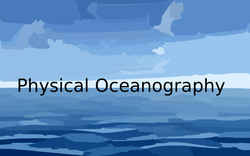

# Introducción
Este es un repositorio de "scripts" para la materia de **Oceanografía Física** que es parte del Curso Básico de Hidrografía. A parte de ayudar el entendimiento de la materia, sirve de motivación para el empleo del lenguaje de programación [Python](https://www.python.org/). Esta organizado por tutoriales que permitirán realizar las diferentes actividades programadas a lo largo del curso.

## Motivación
El océano es un elemento importante en el sistema climático, primordial para la vida, y es el todo para un oceanógrafo. Su entendimiento desde el punto de vista físico, permite comprender los eventos que regulan tanto las condiciones climáticas del planeta, como los proceso biológicos que ocurren en él, sobre todo en el océano. 
Sobre los avances en este entedimiento de los proceso físicos, existe muchísima información en la actualidad. Podemos conocer como era el clima décadas atrás y anticiparnos a como será el clima en el futuro. Sin embargo, esta información si bien disponible, requiere para su acceso y procesamiento, aplicaciones computacionales (i.e. [Panoply](https://www.giss.nasa.gov/tools/panoply/)) o desarrollar nuestros propios scripts para acceder a esta información. Ese es el propósito de este repositorio. 
## No es un curso de Python
No, defintivamente no lo es. Puedo recomendar sin embargo, un video-tutorial que a mí me sirvió: [Python Programming Tutorial](https://youtu.be/HBxCHonP6Ro).
Para quiene quieren ir un poco más alla, les recomiendo este libro:
*A Primer on Scientific Programming with Python (Texts in Computational Science and Engineering)*,de Hans Petter Langtangen
## Cómo ejecutar los notebooks
Los tutoriales pueden ejecutarse usando Jupyter. Desde la carpeta raíz, ejecutar:
```python
jupyter notebook
```
# CONTENIDO

## UNIDAD 1 TEMPERATURA, SALINIDAD Y DENSIDAD DEL AGUA DE MAR
## Actividades
### [1) Configuración Física](https://nbviewer.jupyter.org/github/wrenteria/physicaloceanography/blob/master/notebooks/Actividad_1.ipynb)
En esta actividad se describe las características físicas del océano.
### [2) Diagrama de densidad](https://nbviewer.jupyter.org/github/wrenteria/physicaloceanography/blob/master/notebooks/Actividad_2.ipynb)
En esta actividad se explora la relación entre la Temperatura, la Salinidad y la Presión, y su influencia sobre la densidad del agua de mar. 
### [3) Características del océano](https://nbviewer.jupyter.org/github/wrenteria/physicaloceanography/blob/master/notebooks/Actividad_3.ipynb)
Conocer las características del océano, explorar y determinar valores climatológicos. Explorar los valores de clorofila del océano.
